# Hough Transform
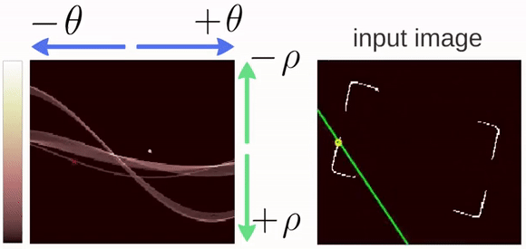

Source: 16720B course materials, Prof.Kris Kitani(CMU)
This repo contains a from-scratch implementation of hough transform. (Implemented as part of the Computer Vision course 16720B at CMU)

## Basic concept behind Hough-transform:

If two edge points lay on the same line, their corresponding cosine curves will intersect each other on a specific (ρ, θ) pair. Thus, the Hough Transform algorithm can detects lines by finding the (ρ, θ) pairs that have a number of intersections larger than a certain threshold.

## Steps in the implementation:

1. **Edge detection with Non-Maximal Suppression(NMS)** (NMS is done to get sharper edges) 

2. **Hough transform with Non-Maximal Supression**(to supress neighbouring hough lines) is applied on the edge magnitude image to identify the hough lines

3. Visualizing intersection of hough lines and edges

## Sample output:

&nbsp;&nbsp;&nbsp;&nbsp;&nbsp;&nbsp;&nbsp;&nbsp;&nbsp;&nbsp;Original image:

&nbsp;&nbsp;&nbsp;&nbsp;&nbsp;&nbsp;&nbsp;&nbsp;&nbsp;&nbsp;

1. Edge detection with NMS

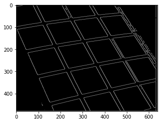

2. Detected Hough lines using **Hough Transform**

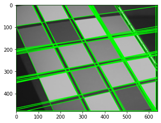 

3. Interesection of Hough lines with edges

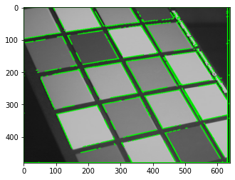

## ***Few more results:***

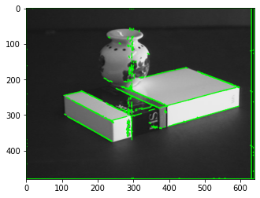

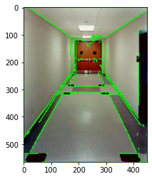

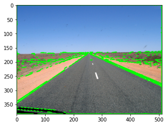

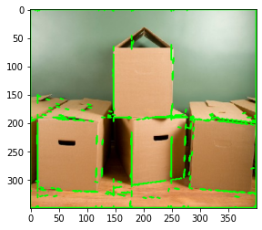

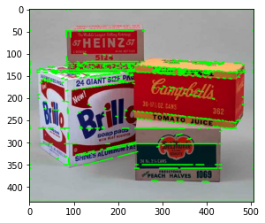

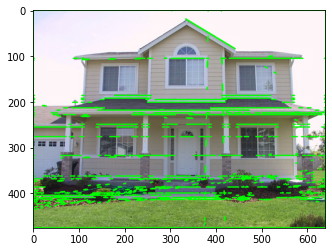

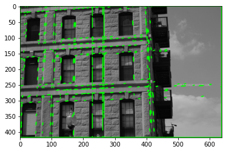

